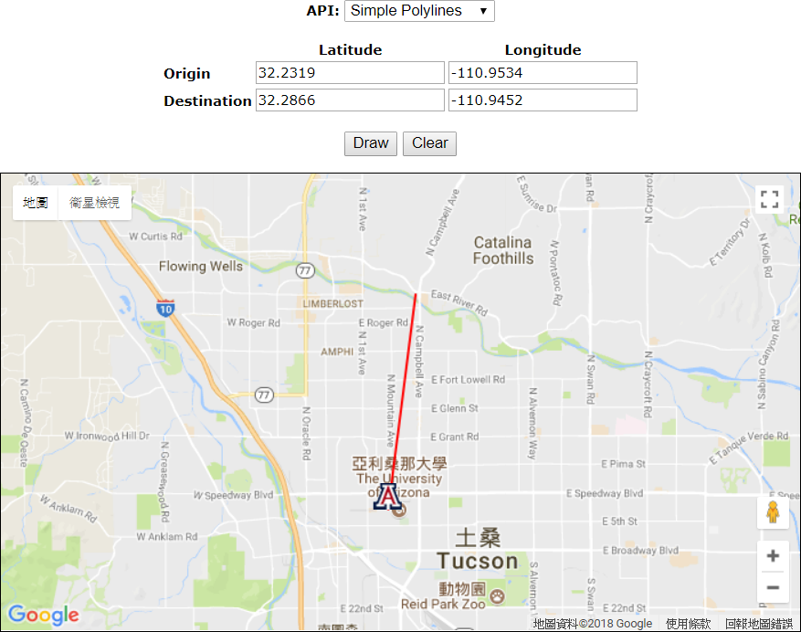
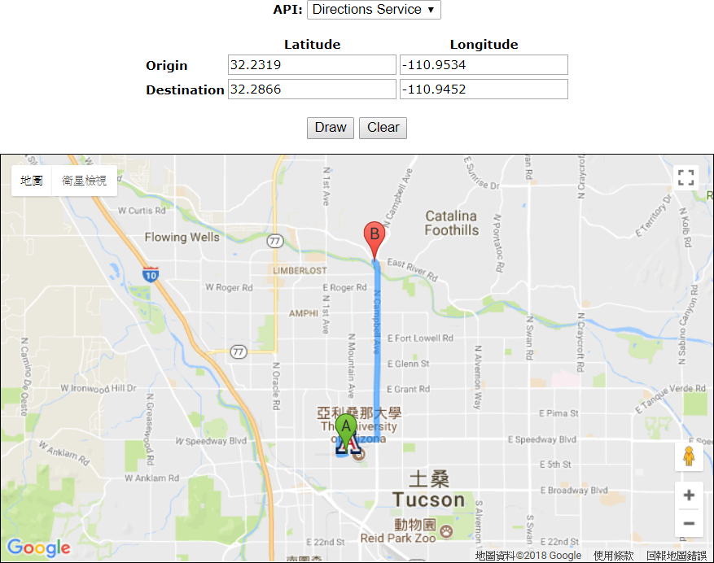
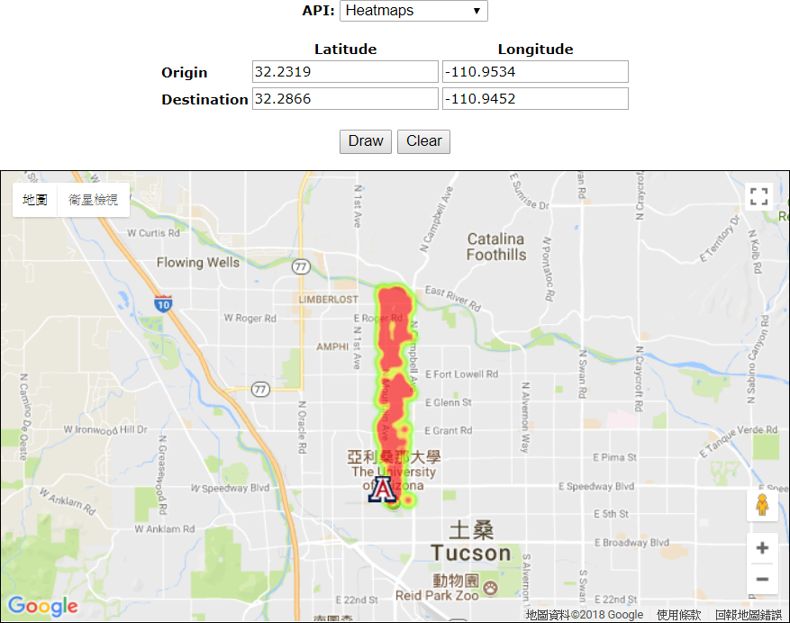
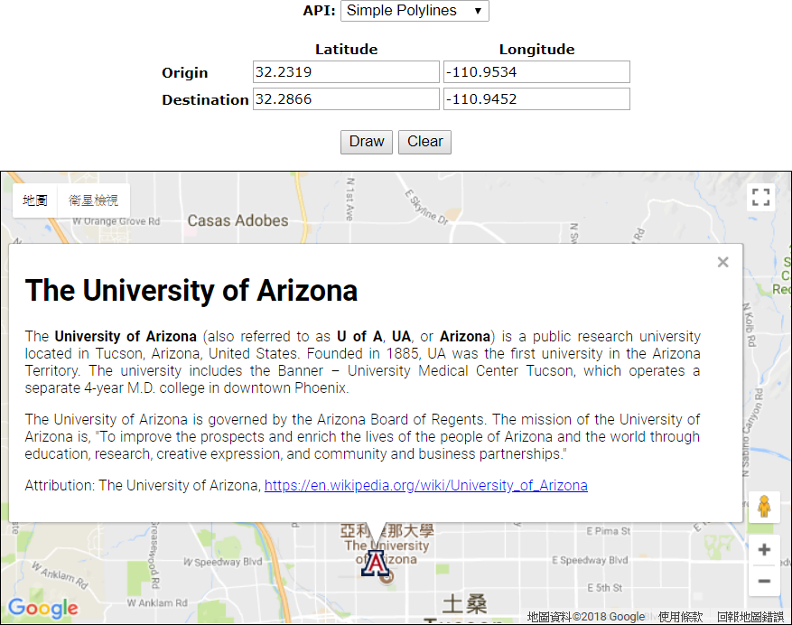

# Google Maps JavaScript API V3 Demo

A lightweight demonstration of Google Maps JavaScript API V3.

## Overview

This is a webpage to demonstrate the following Google Maps JavaScript APIs:

* [Simple polylines  |  Google Maps JavaScript API  |  Google Developers](https://developers.google.com/maps/documentation/javascript/examples/polyline-simple)
* [Directions service  |  Google Maps JavaScript API  |  Google Developers](https://developers.google.com/maps/documentation/javascript/examples/directions-simple)
* [Heatmaps  |  Google Maps JavaScript API  |  Google Developers](https://developers.google.com/maps/documentation/javascript/examples/layer-heatmap)
* [Info windows  |  Google Maps JavaScript API  |  Google Developers](https://developers.google.com/maps/documentation/javascript/examples/infowindow-simple)

## Usage

1. Open `google-maps-js-api-demo.html` in the browser directly, right-click on the map to set origin/destination.
2. Select the corresponding API then click `Draw` to update the map.
3. Use `Clear` button to clear the map.
4. The boundary and the scale of the map will be adjusted automatically.
5. You can also click the "A" logo to learn about the University of Arizona.

## Examples

|Simple polylines|Directions service|
|:---:|:---:|
|||

|Heatmaps|Info windows|
|:---:|:---:|
|||
